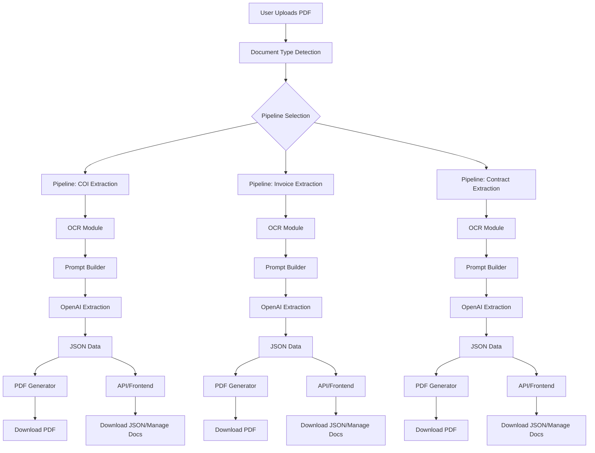

# Multi-Document Extraction Platform with Configurable Pipelines

## Overview

This project is a web-based platform designed to automate the extraction of structured data from a variety of document types (e.g., Certificates of Insurance, invoices, contracts, and more). It leverages Optical Character Recognition (OCR) and advanced language models (OpenAI) to process uploaded PDFs, extract relevant fields, and provide users with downloadable, structured outputs in JSON and PDF formats. The system is architected to support multiple, configurable extraction pipelines, each tailored to a specific document type, making it highly extensible and adaptable to new requirements.

---

## Key Features

- **Multi-Document Support:** Extracts data from various document types, each with its own processing pipeline.
- **Configurable Pipelines:** Each document type can have a unique extraction workflow, including custom OCR settings, prompts, and post-processing logic.
- **PDF Upload:** Users can upload any supported document in PDF format.
- **OCR Processing:** Extracts raw text from PDFs using Google Vision OCR or Tesseract.
- **AI-Powered Data Extraction:** Utilizes OpenAI's language models to parse OCR text and extract structured fields, with prompts tailored per document type.
- **Customizable Field Extraction:** Supports dynamic field/question loading for each pipeline.
- **Downloadable Outputs:** Users can download extracted data as JSON or as a formatted PDF.
- **Document Management:** API endpoints for saving, marking complete, and deleting processed documents.
- **User-Friendly Interface:** Simple web UI for uploading, managing, and downloading documents.

---

## Workflow

1. **Upload:** User uploads a PDF via the web interface.
2. **Document Type Detection:** The system determines the document type (automatically or via user input).
3. **Pipeline Selection:** The appropriate extraction pipeline is selected based on the document type.
4. **OCR:** The system extracts text from the PDF using the pipeline's OCR module.
5. **Prompt Building:** A prompt is constructed for OpenAI using the extracted text and field questions specific to the document type.
6. **OpenAI Extraction:** The OpenAI module processes the prompt and returns structured JSON data.
7. **Post-Processing:** The extracted data is saved, and users can download it as JSON or a formatted PDF.
8. **Document Management:** Users can view, mark complete, or delete processed documents via the API.

---

## Architecture

---

## Technology Stack

- **Backend:** Python (Flask)
- **OCR:** Google Vision API or Tesseract
- **AI Extraction:** OpenAI GPT models
- **PDF Generation:** ReportLab
- **Frontend:** HTML, CSS, JavaScript
- **Data Storage:** JSON files

---

## Module Breakdown

### [`app.py`](app.py)

- Main Flask application.
- Handles routing for file upload, document management, and downloads.
- Orchestrates the workflow between modules.
- Manages pipeline selection and document type routing.

### [`modules/ocr_module.py`](modules/ocr_module.py)

- `run_ocr(pdf_content: bytes) -> str`: Extracts text from PDF files using OCR.
- Can be configured per pipeline for different OCR settings.

### [`modules/openai_module.py`](modules/openai_module.py)

- `extract_json_from_md(system_prompt: str, user_input: str) -> str`: Uses OpenAI to extract structured data from OCR text.
- Prompts and extraction logic can be customized per document type.

### [`modules/pdf_generator.py`](modules/pdf_generator.py)

- `generate_pdf_from_json(data, filename)`: Generates a formatted PDF from extracted JSON data.

### [`modules/prompt_builder.py`](modules/prompt_builder.py)

- `build_prompt() -> str`: Constructs prompts for OpenAI extraction, customizable per pipeline.

### [`modules/question_loader.py`](modules/question_loader.py)

- `load_questions(filepath: str) -> str`: Loads field questions for dynamic extraction, supporting different sets per document type.

---

## API Endpoints

- `POST /upload`: Upload a PDF for processing.
- `GET /get_documents`: List all processed documents.
- `GET /get_processed_files`: List processed files.
- `GET /download_json/<filename>`: Download extracted data as JSON.
- `GET /download_pdf/<filename>`: Download extracted data as PDF.
- `POST /save_json/<filename>`: Save extracted JSON data.
- `POST /mark_complete/<filename>`: Mark a document as complete.
- `DELETE /delete_document/<filename>`: Delete a processed document.

---

## Example Usage

1. **Upload a Document:**  
   Use the web interface to upload a COI, invoice, or contract PDF.

2. **Automatic Pipeline Routing:**  
   The system detects the document type and routes it to the correct extraction pipeline.

3. **View Extracted Data:**  
   After processing, view or download the extracted fields as JSON or PDF.

4. **Manage Documents:**  
   Use the API or UI to mark documents as complete or delete them.

---

## Extensibility & Improvements

- Add new pipelines for additional document types by configuring new OCR, prompt, and post-processing logic.
- Add user authentication and access control.
- Integrate with cloud storage or databases.
- Enhance error handling and logging.
- Add analytics/dashboard for processed documents.
- Improve OCR accuracy with pre-processing.

---

## Real-World Applications

- Insurance agencies automating COI and policy verification.
- Enterprises processing invoices, contracts, and compliance documents.
- Any workflow requiring structured data extraction from diverse, semi-structured documents.

---

## Author & Contact

_This project was developed as a demonstration of automated, multi-document processing using OCR and AI. For more details or collaboration, please contact the project maintainer._
