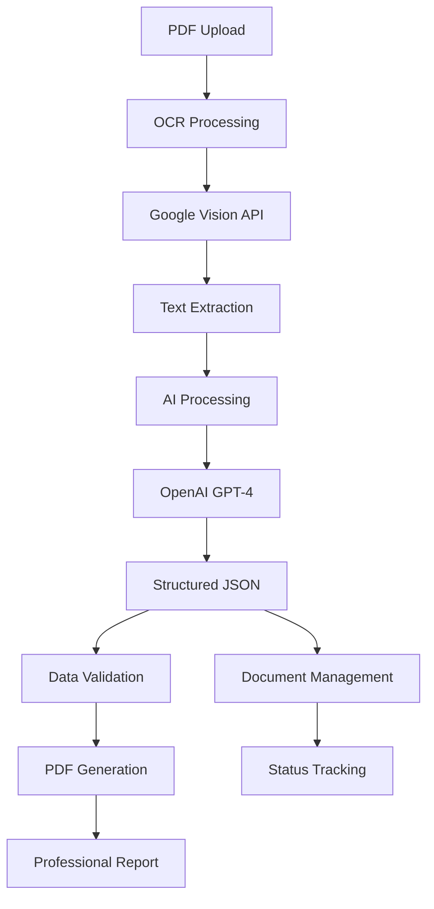

# Tiarna COI Extraction Platform

> **Automated Certificate of Insurance Processing with AI-Powered Data Extraction**

A sophisticated web-based platform that automates the extraction of structured data from Certificate of Insurance (COI) documents using advanced OCR and AI technologies. Built for insurance agencies, enterprises, and compliance teams who need to process large volumes of insurance documents efficiently.

[](https://python.org)
[](https://flask.palletsprojects.com)
[](https://openai.com)
[](https://cloud.google.com/vision)

## 🚀 Features

### Core Capabilities
- **📄 PDF Processing**: Upload and process Certificate of Insurance documents
- **🔍 Advanced OCR**: Google Vision API integration for high-accuracy text extraction
- **🤖 AI-Powered Extraction**: GPT-4 powered intelligent field extraction
- **📊 Structured Output**: Clean JSON data with all insurance fields
- **📋 Professional Reports**: Generate branded PDF reports
- **💾 Document Management**: Complete lifecycle tracking and management

### Insurance Coverage Types
- **Commercial General Liability** (CGL)
- **Automobile Liability**
- **Umbrella Liability**
- **Workers Compensation**
- **Property Insurance**

### User Interface
- **🎨 Modern Web UI**: Clean, professional interface with Tailwind CSS
- **📱 Responsive Design**: Works on desktop, tablet, and mobile
- **🖱️ Drag & Drop**: Intuitive file upload experience
- **📈 Real-time Stats**: Document processing statistics and status tracking
- **✏️ Inline Editing**: Edit extracted data before finalizing

## 🏗️ Architecture



## 🛠️ Technology Stack

### Backend
- **Python 3.8+** - Core programming language
- **Flask 2.2.2** - Web framework
- **Google Vision API** - OCR processing
- **OpenAI GPT-4** - AI-powered data extraction
- **ReportLab** - PDF generation

### Frontend
- **HTML5/CSS3** - Markup and styling
- **Tailwind CSS** - Utility-first CSS framework
- **Vanilla JavaScript** - Interactive functionality
- **Font Awesome** - Icons and UI elements

### Infrastructure
- **JSON File System** - Lightweight data storage
- **Environment Variables** - Secure configuration
- **File-based Configuration** - Easy customization

## 📦 Installation

### Prerequisites
- Python 3.8 or higher
- Google Cloud Platform account with Vision API enabled
- OpenAI API account with GPT-4 access

### Quick Start

1. **Clone the repository**
   ```bash
   git clone https://github.com/harshavv2504/COI_document_extraction.git
   cd COI_document_extraction
   ```

2. **Install dependencies**
   ```bash
   pip install -r requirements.txt
   ```

3. **Set up environment variables**
   ```bash
   # Create .env file
   echo "OPENAI_API_KEY=your_openai_api_key_here" > .env
   ```

4. **Configure Google Vision API**
   - Download your service account JSON key
   - Place it in `config/google_ocr.json`
   - Ensure the file is in your `.gitignore`

5. **Run the application**
   ```bash
   python app.py
   ```

6. **Access the application**
   - Open your browser to `http://localhost:5000`
   - Start uploading and processing COI documents!

## 🔧 Configuration

### Environment Variables
```bash
# Required
OPENAI_API_KEY=your_openai_api_key_here

# Optional
FLASK_ENV=development
FLASK_DEBUG=True
```

### Google Vision API Setup
1. Create a Google Cloud Project
2. Enable the Vision API
3. Create a service account
4. Download the JSON key file
5. Place it in `config/google_ocr.json`

### Customizing Extraction Fields
Edit `field_questions/all_questions.txt` to modify the extraction questions and fields.

## 📖 Usage

### Basic Workflow

1. **Upload Document**
   - Navigate to the Upload tab
   - Drag and drop a PDF file or click to browse
   - Fill in optional metadata (Custom Name, External ID, etc.)
   - Click "Upload Document"

2. **Review Extracted Data**
   - Go to the Generate tab
   - Select your processed file from the dropdown
   - Review and edit the extracted data
   - Save your progress or mark as complete

3. **Download Reports**
   - Generate professional PDF reports
   - Download raw JSON data
   - Manage document status

### API Endpoints

| Method | Endpoint | Description |
|--------|----------|-------------|
| `POST` | `/upload` | Upload and process PDF |
| `GET` | `/get_documents` | List all documents |
| `GET` | `/get_processed_files` | List processed files |
| `GET` | `/download_json/<filename>` | Download JSON data |
| `GET` | `/download_pdf/<filename>` | Download PDF report |
| `POST` | `/save_json/<filename>` | Save progress |
| `POST` | `/mark_complete/<filename>` | Mark as verified |
| `DELETE` | `/delete_document/<filename>` | Delete document |

## 📁 Project Structure

```
COI_document_extraction/
├── app.py                          # Main Flask application
├── requirements.txt                # Python dependencies
├── .env                           # Environment variables
├── .gitignore                     # Git ignore rules
├── README.md                      # This file
├── PROJECT_OVERVIEW.md            # Detailed project documentation
├── config/
│   └── google_ocr.json           # Google Vision API credentials
├── modules/
│   ├── ocr_module.py             # OCR processing
│   ├── openai_module.py          # AI extraction
│   ├── prompt_builder.py         # Prompt construction
│   ├── pdf_generator.py          # PDF report generation
│   └── question_loader.py        # Field questions loader
├── field_questions/
│   └── all_questions.txt         # Extraction field definitions
├── static/
│   ├── styles.css                # Custom CSS
│   ├── script.js                 # Frontend JavaScript
│   └── images/                   # Logo and branding assets
├── templates/
│   └── index.html                # Main HTML template
├── extracted_json/               # Generated JSON files
└── uploads/                      # Temporary file storage
```

## 🔒 Security

- **API Key Protection**: Environment variable storage
- **File Validation**: Secure filename handling
- **Input Sanitization**: XSS protection
- **Error Handling**: No sensitive data exposure

## 🚀 Deployment

### Production Deployment
1. Set up a production server (Ubuntu/CentOS)
2. Install Python 3.8+ and pip
3. Clone the repository
4. Install dependencies: `pip install -r requirements.txt`
5. Configure environment variables
6. Set up reverse proxy (Nginx)
7. Use WSGI server (Gunicorn)

### Docker Deployment
```dockerfile
FROM python:3.9-slim
WORKDIR /app
COPY requirements.txt .
RUN pip install -r requirements.txt
COPY . .
EXPOSE 5000
CMD ["python", "app.py"]
```

## 🤝 Contributing

1. Fork the repository
2. Create a feature branch (`git checkout -b feature/amazing-feature`)
3. Commit your changes (`git commit -m 'Add amazing feature'`)
4. Push to the branch (`git push origin feature/amazing-feature`)
5. Open a Pull Request

## 📝 License

This project is licensed under the MIT License - see the [LICENSE](LICENSE) file for details.

## 🆘 Support

- **Documentation**: Check `PROJECT_OVERVIEW.md` for detailed technical documentation
- **Issues**: Report bugs and request features via GitHub Issues
- **Email**: Contact the development team for enterprise support

## 🏢 About

**Tiarna COI Extraction Platform** is developed by **IndiVillage Tech Solutions** to streamline insurance document processing workflows. The platform combines cutting-edge AI technology with practical business needs to deliver accurate, efficient, and professional document processing solutions.

---

**Built with ❤️ for the insurance industry**
